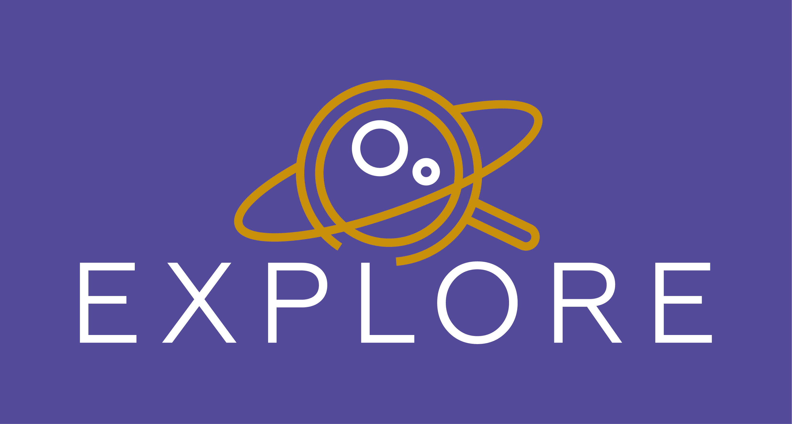

## G-Tomo-3D

G-Tomo-3D exposes the lastest Gaia eDR3 extinction cubes (Lallement et al. 2022, Vergely et al. 2022) for 3D visualisation, slicing (2D), and annotation.

## Software stack

* Dash/plotly : front-end web dashboard
* Visualiser : 3D rendering and slicing
* Python : back-end computations
* Docker : containerisation of code into an image

## SDA Framework

See the EXPLORE docs.

## Data

Input data files can be retrieved from Zenodo [ZenodoID](https://zenodo.org/).

For local deployment these can be added to '_data/app_data/'.

## Create and test locally 

    $ git clone https://github.com/explore-platform/g-tomo-3d.git
    $ cd g-tomo/
    $ docker-compose up --build
    

## Get involved! 

This project relies on contributions from the community. See: https://github.com/explore-platform/explore

### Become a contributor

If you have ideas or suggestions for content for this project, please check out our [contributors' guidelines](CONTRIBUTING.md) and our [roadmap](ROADMAP.md). Please note that by joining this project, you agree to follow the [code of conduct](CODE_OF_CONDUCT.md) in all interactions both on and offline.

## Development roadmap

- [ ] add 3d DIB density data
- [ ] upgrade dust + DIB maps with Gaia DR4 release

## Acknowledgements

This project has received funding from the European Union’s Horizon 2020 research and innovation programme under grant agreement No 101004214. 

 
